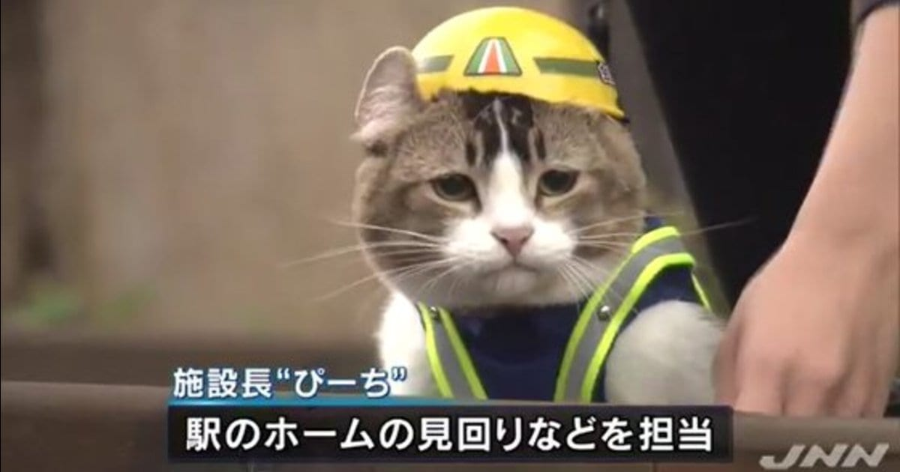

## 概要

基本的には何かを確認して、「ヨシ！」とする生き物。
近年では、酒に溺れたり、自我を持ち出す素振りをする姿が目撃されている。

## 出自

2016年あたりの深夜帯に猫が人語で電話をしている姿が目撃されたことから全てが始まったとされている。
この時には「電話猫」と呼称され、人々の心を鷲掴みにしたようだ。

ちなみにこの時の発した言葉が「どうして夜中に起きてるんですか？」と人の神経を逆撫でするような言葉であったとか。

## 生涯

- 2016年8月 ：産声を上げ人々に認知される。
- 2017年12月：ふたばちゃんねるにて、現場で指差し確認をする姿が目撃される。
- 2019年10月：中央労働災害防止協会とコラボし、[現場で働く外国人向けの漢字ドリル](https://www.jisha.or.jp/order/tosho/index.php?mode=detail&goods_cd=27138)が発売
- 2020年2月 ：[啓発ポスター](https://www.jisha.or.jp/order/poster/index.php?mode=detail&goods_cd=31809)発売。

## 商品化したもの

- [LINEスタンプ](https://store.line.me/stickershop/product/4779375/ja)
- [漢字ドリル](https://www.jisha.or.jp/order/tosho/index.php?mode=detail&goods_cd=27138)
- [啓発ポスター](https://www.jisha.or.jp/order/poster/index.php?mode=detail&goods_cd=31809)
- [ラバーキーチェーン](https://www.amazon.co.jp/%E3%83%88%E3%82%A4%E3%82%BA%E3%82%AD%E3%83%A3%E3%83%93%E3%83%B3-%E4%BB%95%E4%BA%8B%E7%8C%AB%E7%8F%BE%E5%A0%B42-%E3%83%A9%E3%83%90%E3%83%BC%E3%82%AD%E3%83%BC%E3%83%81%E3%82%A7%E3%83%BC%E3%83%B3-%E5%85%A86%E7%A8%AE%E3%83%95%E3%83%AB%E3%82%B3%E3%83%B3%E3%83%97%E3%82%BB%E3%83%83%E3%83%88/dp/B083S95HV3/ref=sr_1_12?dchild=1&keywords=%E3%83%88%E3%82%A4%E3%82%BA%E3%82%AD%E3%83%A3%E3%83%93%E3%83%B3&qid=1596875311&sr=8-12)
- [缶バッチ](https://www.amazon.co.jp/%E4%BB%95%E4%BA%8B%E7%8C%AB-%E7%8F%BE%E5%A0%B4%E3%81%A7%E4%BD%BF%E3%81%88%E3%82%8B%E7%BC%B6%E3%83%90%E3%83%83%E3%82%B8-%E3%82%AC%E3%83%81%E3%83%A3-%E3%82%B3%E3%83%B3%E3%83%97%E3%83%AA%E3%83%BC%E3%83%88-%E3%81%8F%E3%81%BE%E3%81%BF%E3%81%AD/dp/B0858W7G7T/ref=pd_lpo_21_t_2/356-3257112-2617638?_encoding=UTF8&pd_rd_i=B0858W7G7T&pd_rd_r=014e7d50-a044-474e-991d-42764ef4393b&pd_rd_w=PYHTa&pd_rd_wg=HLQCX&pf_rd_p=4b55d259-ebf0-4306-905a-7762d1b93740&pf_rd_r=Q5GY0PRKGAZ1669GM45R&psc=1&refRID=Q5GY0PRKGAZ1669GM45R)
- [ミニフィギュア](https://www.amazon.co.jp/%E3%83%88%E3%82%A4%E3%82%BA%E3%82%AD%E3%83%A3%E3%83%93%E3%83%B3-%E4%BB%95%E4%BA%8B%E7%8C%AB-%E3%83%9F%E3%83%8B%E3%83%95%E3%82%A3%E3%82%AE%E3%83%A5%E3%82%A2%E3%82%B3%E3%83%AC%E3%82%AF%E3%82%B7%E3%83%A7%E3%83%B3-%E3%83%8E%E3%83%BC%E3%83%9E%E3%83%AB5%E7%A8%AE%E3%82%BB%E3%83%83%E3%83%88-%E3%82%B7%E3%83%BC%E3%82%AF%E3%83%AC%E3%83%83%E3%83%88%E3%81%AF%E5%90%AB%E3%81%BE%E3%81%AA%E3%81%84/dp/B07VVV6R47/ref=sr_1_3?dchild=1&keywords=%E3%83%88%E3%82%A4%E3%82%BA%E3%82%AD%E3%83%A3%E3%83%93%E3%83%B3&qid=1596875311&sr=8-3)
- [ミニフィギュア2](https://www.amazon.co.jp/%E3%83%88%E3%82%A4%E3%82%BA%E3%82%AD%E3%83%A3%E3%83%93%E3%83%B3-%E4%BB%95%E4%BA%8B%E7%8C%AB%E3%83%9F%E3%83%8B%E3%83%95%E3%82%A3%E3%82%AE%E3%83%A5%E3%82%A2%E3%82%B3%E3%83%AC%E3%82%AF%E3%82%B7%E3%83%A7%E3%83%B32-%E3%83%8E%E3%83%BC%E3%83%9E%E3%83%AB5%E7%A8%AE%E3%82%BB%E3%83%83%E3%83%88-%E3%82%B7%E3%83%BC%E3%82%AF%E3%83%AC%E3%83%83%E3%83%88%E3%81%AF%E5%90%AB%E3%81%BE%E3%81%AA%E3%81%84/dp/B0856VW9GM/ref=sr_1_2?dchild=1&keywords=%E3%83%88%E3%82%A4%E3%82%BA%E3%82%AD%E3%83%A3%E3%83%93%E3%83%B3&qid=1596875311&sr=8-2)
- [スタンプ](https://www.amazon.co.jp/%E4%BB%95%E4%BA%8B%E7%8C%AB%E7%8F%BE%E5%A0%B4%E3%83%A9%E3%83%90%E3%83%BC%E3%82%AD%E3%83%BC%E3%83%81%E3%82%A7%E3%83%BC%E3%83%B33-%E5%BB%BA%E7%AF%89%E7%8F%BE%E5%A0%B4%E7%B7%A8-%E5%85%A86%E7%A8%AE%E3%82%BB%E3%83%83%E3%83%88-%E3%83%88%E3%82%A4%E3%82%BA%E3%82%AD%E3%83%A3%E3%83%93%E3%83%B3-%E3%80%90%E4%BA%88%E7%B4%84%E5%95%86%E5%93%81%E3%80%91/dp/B08F5CB252/ref=sr_1_2?__mk_ja_JP=%E3%82%AB%E3%82%BF%E3%82%AB%E3%83%8A&dchild=1&keywords=%E3%83%88%E3%82%A4%E3%82%BA%E3%82%AD%E3%83%A3%E3%83%93%E3%83%B3+%E4%BB%95%E4%BA%8B%E7%8C%AB%E7%8F%BE%E5%A0%B4&qid=1596875342&sr=8-2)

## 素材

[ここ](https://kumamine.blogspot.com/2019/12/blog-post_27.html)に顔のみの素材があるので皆これで愛でよう

## 現場猫の肖像

